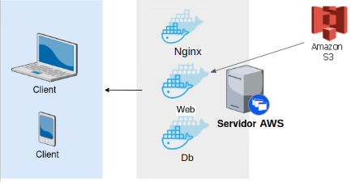

# taxi-company

## Descripción

¡Una nueva aplicación de ride-hailing ha llegado a la ciudad! 
¿Qué estás esperando para ser parte de la nueva sensación?

Con Taxi-Company llegar al lugar que desees y cuándo lo desees ya no es un problema.
Tan solo con un par de clicks desde tu celular, puedes solicitar un vehiculo que, en un par de minutos, llegará a recogerte para llevarte a ese lugar: casa, oficina, centro de salud y por qué no, el mejor carrete de tu vida. 

Este proyecto es el esqueleto de Taxi-Company, donde podrás ver qué tipo de datos se recogen desde la aplicación y cómo se procesan. 
Además, cuenta con una API donde podrás consultar algunos de los datos que se tienen en la base de datos de la app. 

## Requerimientos 

Para poder ejecutar el proyecto de manera local, se necesita contar con la siguiente lista de requerimientos:

1. Tener una copia local del repositorio
    - Clonar el repositorio: `git clone https://gitlab.com/privacy3/taxi-company.git`
2. Tener instalado Docker y docker-compose
    - Para ver si se tiene instalado Docker(ubuntu): `docker --version`
    - Para ver si se tiene instalado docker-compose(ubuntu): `docker-compose --version`
    - Si no se tiene Docker, instalar según este [manual](https://docs.docker.com/engine/install/ubuntu/)
3. Contar con los archivos .env  
    - Algunas secciones del código ocupan variables de entorno que estan almacenadas en archivos .env **locales**. Estos archivos deben ubicarse en la raíz del repositorio.
    - Para ejecutar en ambiente de desarrollo, se debe contar con el archivo .env.dev
    - Para ejecutar en ambiente de desarrollo, se debe contar con el archivo .env.prod
    - Se deben solicitar los valores de las variables. 

## Cómo ejecutar

Debido a que el proyecto está configurado para usar PostgreSQL como base de datos
por defecto, la ejecución de la aplicación debe ser mediante docker-compose.

El repositorio cuenta con dos archivos docker-compose, uno para ambiente de desarrollo
y otro para ambiente de producción. 

### Ejecutar con Make

Para la entrega 2, se agrego un archivo `Makefile`, que contiene shorcuts para ejecutar el proyecto con permisos y así tener menos problemas en el desarrollo.
Por ejemplo: `make web-bash` levanta el servicio web y sus requisitos, para posteriormente entrar en la shell del contenedor. Esto es util para ejecutar comandos dentro del contenedor.
#### Comandos:
##### Construir contenedor de docker:
`make build`
##### Detener los contenedores.
`make stop`
##### Corre los test en modo attached
`make test`
##### Corre el contenedor web y sus requisitos en modo attached
`make web-attached`
##### Corre el contenedor web y sus requisitos en modo detached
`make web-detached`
##### Corre el contenedor web y sus requisitos en modo deatached y despues entra a su bash shell
`make web-bash`
##### INVOCA AL DIAULO Y BORRA TODO
`make clean`

Pueden leer el `Makefile` para mayor informacion.

### Ejecutar en ambiente dev

Para ejecutar en el ambiente de desarrollo, se debe contar con el archivo .env.dev y trabajar con `docker-compose.dev.yml`, siguiendo los pasos a continuación:
1. Se hace build de los contenedores: `docker compose -f docker-compose.dev.yml build`
2. Se corren los contenedores: `docker compose -f docker-compose.dev.yml up -d`

Si los pasos anteriores resultaron exitosos, la aplicación debería estar corriendo localmente. 

Se puede ver el estado de los contenedores: `docker compose -f docker-compose.dev.yml logs`
Si se quiere ver el estado de un contenedor específico se puede ejecutar: `docker compose -f docker-compose.dev.yml logs <nombre-contenedor>`

Para detener la ejecución, se tienen los siguientes comandos:
- Para detener los contenedores: `docker compose -f docker-compose.dev.yml stop`
- Para detener y remover los contenedores: `docker compose -f docker-compose.dev.yml down`
- Para detener y remover los contenedores, además de eliminar los volúmenes: `docker compose -f docker-compose.dev.yml down -v`

### Ejecutar en ambiente prod

Para ejecutar en el ambiente de producción, se debe contar con el archivo .env.prod y trabajar con `docker-compose.yml`, siguiendo los pasos a continuación:
1. Se hace build de los contenedores: `docker-compose build`
2. Se corren los contenedores: `docker-compose up -d`
3. Se corren las migraciones de Django: 
    - Entrar a la consola del servicio web: `docker-compose exec web bash`
    - Correr las migraciones: 
        - `python manage.py makemigrations`
        - `python manage.py migrate`
    - Recolectar archivos estáticos: `python manage.py collectstatic`
    - Salir de la consola con: `exit`

Si los pasos anteriores resultaron exitosos, la aplicación debería estar corriendo localmente. 

Se puede ver el estado de los contenedores: `docker-compose logs`
Si se quiere ver el estado de un contenedor específico se puede ejecutar: `docker-compose logs <nombre-contenedor>`

Para detener la ejecución, se tienen los siguientes comandos:
- Para detener los contenedores: `docker-compose stop`
- Para detener y remover los contenedores: `docker-compose down`
- Para detener y remover los contenedores, además de eliminar los volúmenes: `docker-compose down -v`

## Interactuar con la API

El proyecto considera una API creada en Django-REST, que cuenta con endpoints disponibles para consultas.
Esta API corre en una máquina de AWS. 
A continuación, se listan los endpoints disponibles:
-   https://taxi.nookprivacy.cl/api/clients/
-   https://taxi.nookprivacy.cl/api/clients/<id_client_especifico>/
-   https://taxi.nookprivacy.cl/api/drivers/
-   https://taxi.nookprivacy.cl/api/drivers/<id_driver_especifico>/
-   https://taxi.nookprivacy.cl/api/trips/
-   https://taxi.nookprivacy.cl/api/trips/<id_trip_especifico>/
-   https://taxi.nookprivacy.cl/api/routes/
-   https://taxi.nookprivacy.cl/api/routes/<id_route_especifico>/
-   https://taxi.nookprivacy.cl/api/background-checks/
-   https://taxi.nookprivacy.cl/api/background-checks/<id_background_check_especifico>/
-   https://taxi.nookprivacy.cl/api/client-payments/
-   https://taxi.nookprivacy.cl/api/client-payments/<id_client_payment_especifico>/
-   https://taxi.nookprivacy.cl/api/driver-payments/
-   https://taxi.nookprivacy.cl/api/driver-payments/<id_driver_payment_especifico>/
-   https://taxi.nookprivacy.cl/api/ride-chats/
-   https://taxi.nookprivacy.cl/api/ride-chats/<id_ride_chat_especifico>/

## Arquitectura

La arquitectura del proyecto se puede representar con un diagrama como el que se muestra a continuacion.

### Ambiente de Desarrollo

Para el ambiente de desarrollo, se cuenta con 3 contenedores: 
- contenedor web con la aplicación de Django, que utiliza el servidor de Django.
- contenedor db con la base de datos PostgreSQL.
- contenedor de test la aplicación de Django, que corre todos los test. 

### Ambiente de Producción

Para el ambiente de producción, se cuenta con 3 contenedores: 
- contenedor de nginx, que actúa como servidor web. 
- contenedor web con la aplicación de Django, que utiliza gunicorn como servidor WSGI.
- contenedor db con la base de datos PostgreSQL.

Además, se utiliza S3 para almacenamiento de imágenes.

## Autores 

**Idea del proyecto**
- Nicolás Varas Cortés, @nwvaras
- Kelly Wagemann Simmonds, @kelly97wagemann

**Código**
- Nicolás Varas Cortés, @nwvaras
- Kelly Wagemann Simmonds, @kelly97wagemann

## Recursos
1. [Documentación oficial de Docker y docker-compose](https://docs.docker.com/engine/reference/commandline/compose_up/#:~:text=The%20docker%20compose%20up%20command,flooded%20by%20some%20verbose%20services.)
2. [Tutorial de Django](https://docs.djangoproject.com/en/4.1/intro/tutorial01/)
3. [Tutorial de Django-REST](https://www.django-rest-framework.org/tutorial/quickstart/)